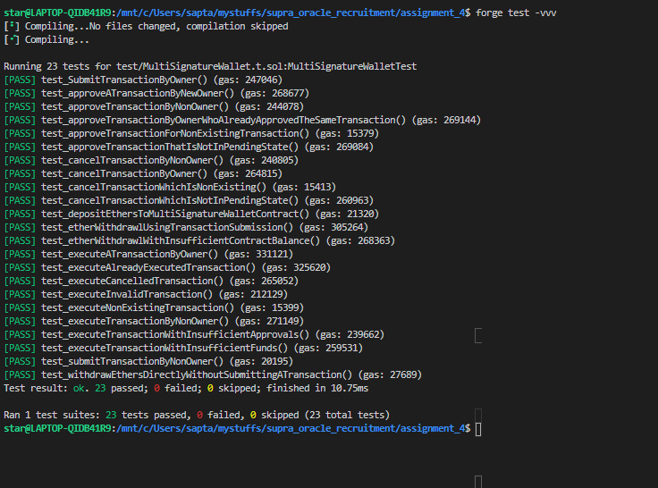

# Multi-Signature Wallet

## Problem Description

Create a multi-signature wallet smart contract using Solidity. The contract should allow multiple owners to collectively control the funds in the wallet. The key features include:

## Design Choices

- I utilized an enum to keep track of the transaction state. Transactions can exist in one of three states: `PENDING`, `EXECUTED`, or `CANCELLED`. Only transactions in the PENDING state are eligible for further action.
- To minimize the computational overhead of counting approvals during transaction execution, I introduced an `approvalCount` variable within the transaction struct.
- I included a `creator` variable within each transaction to identify the initiator of the transaction.
- I established a mapping `transactionIndex -> address -> bool`, to check approval status of owners against each transactions
- To facilitate easy retrieval of the complete list of owners, I maintained a separate array of owners within the contract.
- To prevent unauthorized removal of legitimate owners, I disallowed the removal of owners after contract deployment.
- I configured the `submitTransaction` function as payable, enabling convenient fund transfers as part of a transaction, if necessary.
- To reduce code redundancy and encourage modularity, I used modifiers such as `isTransactionExisting`, `onlyOwner`, and `isTransactionPending`.
- I incorporated an `isOwner` mapping to expedite the verification of ownership status, enhancing gas optimization compared to iterating through owner arrays.
- To provide transparency and access to contract information, I incorporated view functions that enable users to retrieve lists of owners and transactions.
- I implemented a `require` check to prevent approving a transaction twice by the same owner.

## Security Considerations

- To ensure secure withdrawals, I employed a `require` statement that verifies that only the contract itself can initiate withdrawal actions. This aligns with the security principles of a multi-signature wallet.
- To withdraw funds, owner must submit a transaction, which should be approved by required number of owners to meet execution threshold. Only then the withdrawl can be initiated.
- Prior to executing any transaction or initiating a withdrawal, I included a `require` check to confirm the availability of sufficient funds within the contract.
- I utilized modifiers to confirm that a transaction is in the `PENDING` state before allowing it to be executed.
- Once a transaction is executed, it cannot be executed or canceled again, and the same rule applies to canceling a transaction. These prevents double execution or ambiguity.
- Prior to executing a transaction, I ensure that the `approval limit` has been reached. Only then can the transaction be executed.

## Test Cases

- Test cases can be found in TestCases.yml format, it is written as a YML List format to ensure readability. Here is an example

```yml
- TestCaseId: 1
  TestDescription: Owner submits a transaction
  Expected: The transaction is stored in the transactions list
```

- TestCaseId is the serial number of test case
- TestDescription provides comprehensive description of testcase
- Expected provides the expected output of the testcase



## Features

- A wallet with multiple owners, each having their own private key.
- A specified number of owners (threshold) is required to approve and execute a transaction.
- Owners can submit, approve, and cancel transactions.

## Requirements

- Implement the smart contract in Solidity.
- Use appropriate data structures to manage owners and transactions.
- Include proper access controls and security measures.
- Ensure efficient handling of transactions and gas optimization.
